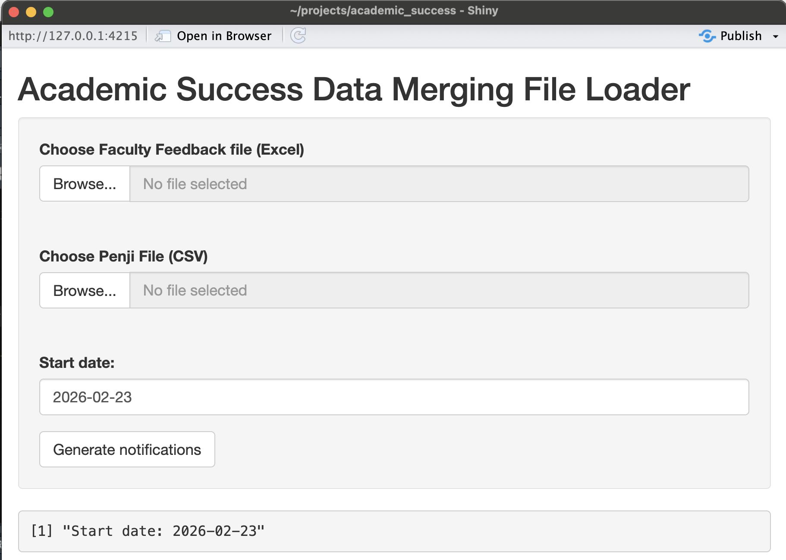

# Academic Success Data Merge



This app takes as inputs:

-   An Excel workbook containing faculty feedback form submissions, concerning student success in specific courses. TODO: Add column name assumptions - The data should be cumulative from the beginning of the semester.
-   A CSV-formatted Penji export containing information on student visits to Academic Commons for peer tutoring and/or review sessions, for specific courses. TODO: Add column name assumptions - The data should be cumulative from the beginning of the semester - A start date, so that we can limit the scope to faculty feedback only after a certain date. - A file listing courses for which Academic Commons currently offers tutoring. Format is one course per line, of the format `BWVG 1011: Comparative Basket Weaving`

The app determines which students have been:

A)  identified as potentially benefitting from Academic Commons services, *AND*
B)  have not yet visited Academic Commons for tutoring (if available for the course) and/or review sessions (if available for the course)

It creates as outputs:

-   An Excel workbook containing a list of student email addresses, and notification messages that these students should receive.

The app is run as an R Shiny app.

## Installation

```         
git clone https://github.com/gwu-libraries/ac_wrangling.git
```

In RStudio, run `app.R` as a Shiny App using the Run App  button. Select the relevant files, the correct sheet within the faculty feedback Excel file, and the start date. Press "Generate Notifications" and download the result file.
